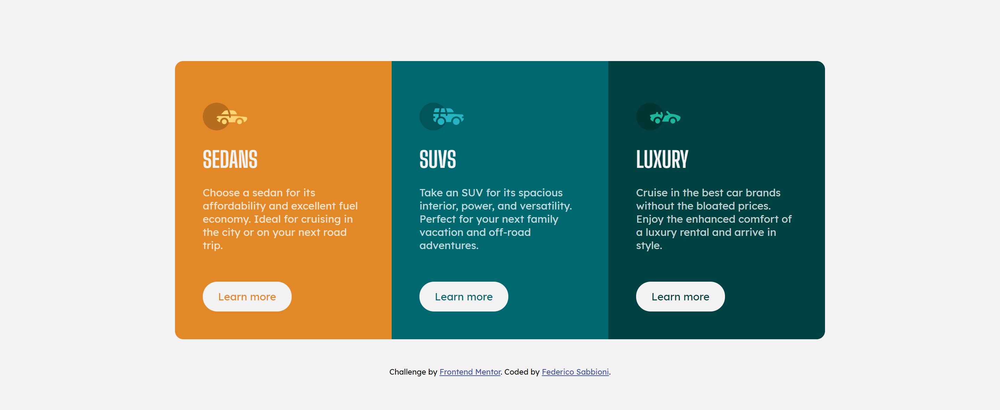

# Frontend Mentor - 3-column preview card component solution

This is a solution to the [3-column preview card component challenge on Frontend Mentor](https://www.frontendmentor.io/challenges/3column-preview-card-component-pH92eAR2-) by Federico Sabbioni.

## Table of contents

- [Overview](#overview)
  - [The challenge](#the-challenge)
  - [Screenshot](#screenshot)
      - [DESKTOP (1440px)](#DESKTOP-(1440px))
      - [MOBILE (375px)](#MOBILE-(375px))
  - [Links](#links)
- [My process](#my-process)
  - [Built with](#built-with)

## Overview

### The challenge
Users should be able to:

- View the optimal layout depending on their device's screen size
- See hover states for interactive elements

Read [README-Challenge.md](./README-Challenge.md) for the challenge description.

### Screenshot
#### DESKTOP (1440px)

#### MOBILE (375px)

### Links

- Solution URL: [Solution URL](https://github.com/federicosabbioni/FEM-3-column-preview-card)
- Live Site URL: [Add live site URL here](https://federicosabbioni.github.io/FEM-3-column-preview-card/)

## My process

### Built with

- Semantic HTML5 markup
- SASS
- CSS custom properties
- Flexbox
- Mobile-first workflow
